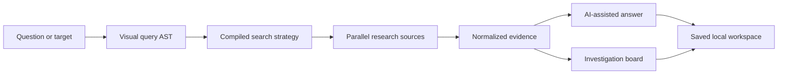
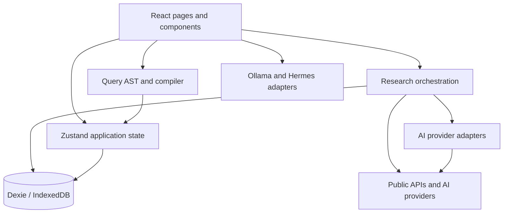

# QueryRecon

### Build complex search strategies. Research across many sources. Turn evidence into an investigation graph.

QueryRecon is a local-first OSINT workspace that combines a visual query compiler, multi-source research pipeline, AI-assisted analysis, reusable dork templates, and an investigation board in one browser application.

It is designed for researchers who need more than a text box: build a search as a structured Boolean tree, inspect how it compiles, collect evidence from independent providers, save the work automatically, and connect findings on a persistent canvas.

[](https://react.dev/)
[](https://www.typescriptlang.org/)
[](https://vite.dev/)
[](https://github.com/GajjarKashyap/QueryRecon/releases/tag/v2.0.0)
[](#privacy-and-security-model)

> QueryRecon was previously named GoogleDorker. The project has grown from a dork builder into a broader research and investigation workspace.

## Versions

- **V2.0.0 (current):** Advanced research mode, AI Court, investigation board, multi-provider AI, DeepSeek support, MiniCPM5 and Hermes local assistants, persistent workspaces, and the upgraded interface.
- **V1.0.0 (legacy):** The original QueryRecon release remains available from the [`v1.0.0`](https://github.com/GajjarKashyap/QueryRecon/tree/v1.0.0) tag.

## Why QueryRecon?

Most query tools stop after producing a search string. QueryRecon supports the complete investigation loop:



- Build deeply nested `AND`, `OR`, and `NOT` logic visually.
- Translate plain-language intent into a starting query tree.
- Assess query breadth, sensitivity, and likely result quality before searching.
- Research the same topic across academic, reference, media, document, news, and specialist sources.
- Continue receiving useful results when one public provider is unavailable or rate-limited.
- Keep investigations, findings, history, boards, and cached results in the browser.
- Use cloud AI providers, a private MiniCPM model, or a local Hermes Agent gateway.

## Feature overview

| Area | What QueryRecon provides |
| --- | --- |
| Query Builder | Visual AST editor, nested Boolean groups, live compilation, natural-language starting points, explanation, assessment, undo and redo |
| Query Intelligence | Detects broad or risky patterns, estimates query quality, and provides actionable improvement guidance |
| Research Mode | Quick, Balanced, and Deep collection modes with parallel source execution and visible source status |
| Academic Search | Merged OpenAlex, Crossref, and Semantic Scholar results with deduplication, ranking, caching, and partial-failure recovery |
| AI Analysis | Gemini, OpenAI, and DeepSeek research answers; DeepSeek model discovery and automatic fallback instead of one hard-coded model |
| AI Court | Solo one-model analysis or any two Gemini, DeepSeek, OpenAI, or Claude models, optional cross-examination, custom model IDs, one final ruling, reasoning panels, usage metadata, and persistent case URLs |
| Rich Answers | Markdown, tables, links, code blocks, safe external images, mathematical notation, and Mermaid-compatible content rendering |
| Investigation Board | Persistent infinite canvas with findings, notes, links, images, editable tables, labeled connections, zoom, pan, and multiple boards |
| Research Persistence | Automatic IndexedDB checkpoints after completed sources and restoration after navigation or refresh |
| Query Library | Built-in templates, saved queries, sessions, history, operator reference, and workspace import/export |
| Local Assistant | MiniCPM5-1B through Ollama for private guidance and deterministic in-app navigation/query actions |
| Hermes Agent | Optional local gateway for Hermes tools, skills, and memory with explicit endpoint, key, CORS, and permission controls |
| Guided Onboarding | First-run tour, optional cloud-key and model setup, Ollama/Hermes configuration, secure skip, and return to the originally requested page |

## Complete investigation workflows

QueryRecon V2 is designed as a connected workspace rather than a collection of isolated tools:

1. **Build and research:** describe an objective, refine the generated Boolean AST, compile it for a search engine, and send the strategy into Research Mode.
2. **Collect and verify:** run reference, academic, book, document, video, news, and specialist sources in parallel; keep successful evidence when an individual provider fails; then generate a rich cited synthesis.
3. **Analyze or debate difficult decisions:** use Solo AI for one model and one paid call, or send the same question to any two Gemini, DeepSeek, OpenAI, or Claude models. Standard Court uses three calls; God Mode adds reciprocal review for a five-call ruling.
4. **Map the evidence:** move findings into the Investigation Board, add notes, links, images, tables, and labeled relationships, and preserve multiple canvases locally.
5. **Use local agents:** run MiniCPM5 through Ollama for private QueryRecon guidance and safe in-app actions, or connect Hermes for its independent tools, skills, memory, browser, and terminal workflows.
6. **Resume later:** research checkpoints, AI Court cases, chats, boards, sessions, queries, history, and preferences persist in the same browser profile.

## Visual Query Builder

The builder represents a query as an abstract syntax tree instead of an unstructured string. Every node is either a Boolean group or a search condition. QueryRecon recompiles the tree immediately after each edit.

Supported workflows include:

- Create nested Boolean groups without manually balancing parentheses.
- Combine search operators such as `site`, `filetype`, `intitle`, `inurl`, and free text.
- Generate a starting AST from a natural-language description.
- View a plain-language explanation of the compiled query.
- Run a local assessment for breadth, sensitivity, and likely usefulness.
- Undo or redo query-tree mutations.
- Start from a built-in template, then modify it visually.
- Save the finished query or send it into Research Mode.

Example intent:

```text
Find public PDF security reports on example.com that mention ransomware,
but exclude press releases.
```

The important difference is that the resulting logic remains editable as a tree; it is not trapped inside a generated text string.

## Research Mode

Research Mode treats the user's question as the task and collected material as evidence. It does not mistake the question itself for a source document. When collected sources cannot verify a claim, the answer should distinguish general model knowledge from source-backed findings.

### Research depth

| Mode | Collection strategy | Answer style | Relative usage |
| --- | --- | --- | --- |
| Quick | Focused selected sources and a compact result set | Short answer with key facts | `$` |
| Balanced | Broader retrieval and more supporting material | Explanations, examples, and trade-offs | `$$` |
| Deep | Topic-aware source expansion, larger result limits, and deeper evidence collection | Detailed report, comparison tables, caveats, and decision criteria | `$$$` |

The dollar symbols show relative provider usage, not a price quote. Actual cost depends on the selected AI provider, available model, source count, prompt size, and answer length.

### Built-in research sources

| Source group | Providers and behavior |
| --- | --- |
| Reference | Wikipedia with focused query expansion and fallback searches |
| Academic | OpenAlex, Crossref, and Semantic Scholar merged into one deduplicated result set |
| Books | Google Books metadata and descriptions |
| Documents | Topic-aware document search strategies and file-oriented dorks |
| Video | YouTube search links and targeted video queries |
| News | News-focused search strategies |
| Environment | OpenWeatherMap when an API key is configured |
| Security | AlienVault OTX and URLhaus integrations |
| Reconnaissance | DomainsDB domain lookup |
| Government | OpenFEC candidate data when configured |
| Cryptocurrency | CoinGecko search |
| Generic APIs | JSON responses normalized into readable titles, URLs, snippets, and metadata |

Collectors run independently where possible. A failed `429`, network error, CORS rejection, or unavailable public API remains visible without erasing successful results from other sources.

### Academic result recovery

Academic research does not depend on a single provider:

1. QueryRecon expands comparison and natural-language questions into focused searches.
2. OpenAlex, Crossref, and Semantic Scholar run as a provider group.
3. Papers are deduplicated by DOI and normalized title.
4. Results are ranked using relevance, citations, and recency signals.
5. Provider status is retained so “no matches” is not confused with “provider failed.”
6. Successful responses are cached locally to reduce repeated public-API traffic.

### Automatic research saving

Research work is checkpointed into IndexedDB as sources complete. QueryRecon restores the latest topic, selected sources, answer depth, collected results, findings, and active tab when Research Mode mounts again. Navigating to another page does not intentionally discard the active investigation.

## Investigation Board

The board turns collected material into a persistent visual investigation rather than a flat list.

Available node types:

- Finding cards for collected evidence.
- Notes for hypotheses, questions, and analyst commentary.
- Link cards for external references.
- Image cards for visual evidence.
- Editable tables with dynamic rows, columns, and cells.

Boards support multiple saved workspaces, draggable positioning, labeled edges, zooming, panning, and persistent node data through IndexedDB.

## AI and local-agent support

### One-click Windows setup

Double-click `setup-queryrecon.bat`. The guided setup asks for Gemini, an optional DeepSeek key, and model IDs; configures Hermes; generates a separate gateway password; starts Hermes and QueryRecon; and imports everything into the canonical `http://localhost:5173` browser profile. Secrets are masked, written only to Hermes and `.queryrecon-local/`, transferred through a random one-use localhost token, and excluded from Git.

### First-run welcome and setup

Every new browser profile opens `/welcome` before the main application. The three-step guide explains Research Mode, Query Builder, AI Court, Investigation Board, MiniCPM, and Hermes; accepts optional Gemini, DeepSeek, OpenAI, and Claude keys with preferred model IDs; and configures either Ollama or Hermes. Users can skip without entering a key. Completion is stored only in that browser profile, and a direct link returns to its original destination after setup.

### Cloud AI providers

| Provider | Use in QueryRecon |
| --- | --- |
| Google Gemini | Natural-language query parsing and research summarization |
| OpenAI | Advanced research analysis |
| DeepSeek | Cost-aware research analysis with runtime model discovery, ranking, and fallback |
| Anthropic Claude | Long-context analysis and an additional AI Court participant or judge |

Provider model names are not assumed to exist forever. DeepSeek queries the models available to the supplied key and can select an appropriate available model instead of relying only on a hard-coded identifier.

### AI Court

The dedicated `/ai-court` workspace supports a one-call **Solo AI** analysis or sends the same question and saved case history to any two Gemini, DeepSeek, OpenAI, or Claude models concurrently. Both court seats may use the same provider with different models. Model discovery preserves the current selection, and every provider has a custom model-ID option. Standard Court gathers two independent opinions and asks the selected judge to produce one ruling. God Mode adds reciprocal cross-review before the ruling and requests the providers' strongest available reasoning/output settings.

| Mode | Deliberation | Maximum paid calls per question |
| --- | --- | --- |
| Solo AI | One selected model produces the saved analysis and ruling | 1 |
| Standard | Two parallel opinions, then one final judge | 3 |
| God Mode | Two parallel opinions, two cross-reviews, then one final judge | 5 |

Every case receives an ID and is saved to IndexedDB before the first provider request. QueryRecon then checkpoints opinions, reviews, failures, final rulings, model IDs, timing, and reported token usage. Cases have addressable `/ai-court/:caseId` routes and survive navigation or refresh in the same browser profile.

Court answers support GitHub-flavored Markdown tables, code blocks, safe HTTPS-linked images, and constrained bar charts. Models can request a chart with a fenced `chart` block containing JSON fields for `title`, `labels`, `values`, and optional `unit`. Provider-supplied reasoning is shown in a collapsed panel when the API returns it. QueryRecon does not expose hidden reasoning that a provider does not return, and model consensus is not a guarantee of factual correctness.

God Mode is never enabled automatically. It intentionally favors depth over cost and can make up to five billable calls, so review each provider's current pricing and account limits before using it.

### Private MiniCPM5 assistant through Ollama

QueryRecon supports **OpenBMB MiniCPM5-1B Q4_K_M** as a compact local guide. Direct Ollama mode can:

- Explain QueryRecon pages and workflows.
- Open recognized application pages.
- Create or replace a Query Builder query from a user request.
- Undo the latest query edit.

In-app actions are determined and validated by QueryRecon rather than trusting arbitrary model-generated tool calls. When Ollama returns a thinking trace, QueryRecon shows it in a collapsed panel. The assistant receives no filesystem, shell, deletion, or arbitrary network tool from QueryRecon. Chat history is saved locally, reused as bounded context, and can be exported as Markdown.

Default configuration:

```text
Ollama endpoint: http://localhost:11434
Model name:      minicpm5-1b
```

Create the model from a downloaded GGUF with a Modelfile:

```text
FROM C:/path/to/MiniCPM5-1B-Q4_K_M.gguf

TEMPLATE """{{- if .Messages -}}
{{- range .Messages -}}
<|im_start|>{{ .Role }}
{{ .Content }}<|im_end|>
{{ end -}}
<|im_start|>assistant
{{ end -}}"""

PARAMETER stop "<|im_end|>"
PARAMETER stop "</s>"
PARAMETER temperature 0.7
PARAMETER top_p 0.95
PARAMETER num_ctx 1024
PARAMETER num_batch 32
```

Then run:

```powershell
ollama create minicpm5-1b -f .\Modelfile
ollama list
```

The repository also includes `Modelfile.minicpm5-low-memory`. Place the GGUF beside that file, then pass it to `ollama create`. The 1K context and reduced batch are intended for memory-constrained Windows systems. Increase them only after confirming the model loads reliably with `ollama run`.

Hermes Agent requires a context window of at least 64K for its full tool loop. The low-memory MiniCPM profile above is therefore intended for QueryRecon's direct assistant, not Hermes.

### Hermes Agent gateway

Hermes mode connects QueryRecon to the local Hermes OpenAI-compatible API. Hermes supplies its own tools, skills, memory, and permission model; QueryRecon does not silently convert Hermes text into browser actions. The dedicated `/hermes-agent` workspace can discover the models configured in Hermes and send real per-request provider/model overrides for a local custom endpoint, Gemini, or DeepSeek.

Run `hermes model` first. Choose **Custom endpoint** for local Ollama, **Google AI Studio** for Gemini, or **DeepSeek** for the DeepSeek API. Hermes stores provider credentials in its own `~/.hermes/.env`; provider secrets are not sent inside QueryRecon chat requests.

Enable the Hermes API server in `%USERPROFILE%\.hermes\.env`:

```env
API_SERVER_ENABLED=true
API_SERVER_KEY=replace-with-a-strong-local-secret
API_SERVER_CORS_ORIGINS=http://localhost:5173
```

Start the gateway:

```powershell
hermes gateway run
```

Then open **Hermes Agent** in QueryRecon, use `http://localhost:8642` as the endpoint, enter the matching gateway key, and select **Test gateway and discover models**. The floating assistant exposes the same runtime, provider, and discovered-model controls while retaining its saved chat.

While a model is working, QueryRecon shows a dedicated reasoning-status animation in AI Court, the Hermes workspace, and the floating assistant. When Ollama or Hermes explicitly returns a thinking or reasoning field, it is saved with the chat and displayed in a collapsible panel. QueryRecon never fabricates or claims access to hidden reasoning that the provider did not return.

> Hermes can access terminal, filesystem, browser, and other toolsets enabled in its own configuration. Keep the gateway bound to localhost, require an API key, restrict CORS, and disable toolsets you do not want it to use.

### Hermes-only command-line interface

QueryRecon V2 also includes a standalone Hermes command deck for people who want the agent without opening the web application. It has a colored ASCII interface, animated work states, saved conversation context, returned-reasoning display, model discovery, provider/model switching, health checks, and Markdown export. The CLI makes no direct Gemini, DeepSeek, or Ollama calls: Hermes remains the single agent runtime and controls its own tools, skills, memory, provider routing, and permissions.

Start the Hermes gateway, then run the guided CLI setup:

```powershell
hermes gateway run
npm run cli:setup
npm run cli
```

On Windows, `queryrecon-cli.bat` opens the same interface with one double-click. Setup asks for the local endpoint, gateway API key, provider slug, model ID, and timeout. The endpoint is intentionally restricted to `localhost`, `127.0.0.1`, or `::1`. CLI settings and the last 100 chat messages are saved under `.queryrecon-local/`, which is excluded from Git.

Useful commands inside the command deck:

| Command | Action |
| --- | --- |
| `/doctor` | Check the Hermes gateway and discover models |
| `/models` | Show models available for the active provider |
| `/provider <slug>` | Switch the Hermes provider override |
| `/model <id>` | Switch the Hermes model override |
| `/new` | Clear saved conversation context |
| `/save [path]` | Export the conversation and returned reasoning as Markdown |
| `/setup` | Reconfigure the local gateway connection |
| `/exit` | Save and close the CLI |

For a single non-interactive request, use `npm run cli -- --prompt "your task"`. Set the standard `NO_COLOR` environment variable to disable ANSI color; animation automatically stays off when output is redirected or the terminal is non-interactive.

If Hermes reports a Windows `.hermes-tmp` write failure or writes outside the repository, double-click `repair-hermes-workspace.bat` (or run `npm run hermes:repair`). It pins Hermes to this repository, selects Git for Windows Bash for file operations, and restarts the gateway without changing provider keys.

## Architecture

QueryRecon is a client-side React application with separated UI, domain, research, and persistence layers.



Important directories:

```text
src/
├── app/                 Application shell and routes
├── components/
│   ├── assistant/       Local MiniCPM and Hermes interface
│   ├── board/           Investigation-board node types
│   ├── layout/          Sidebar and application layout
│   ├── research/        Rich research-answer rendering
│   └── ui/              Shared controls, toasts, and activity states
├── core/
│   ├── ai/              AI orchestration modules
│   ├── research/        Source collectors, normalization, caching, expansion
│   ├── compiler.ts      AST-to-query compiler
│   ├── query.ts         Query types
│   ├── queryIntelligence.ts
│   └── localAssistant.ts
├── pages/               Dashboard, Builder, Research, Board, Settings, libraries
└── store/               Zustand stores and Dexie database
cli/
└── queryrecon-cli.mjs   Hermes-only terminal command deck
```

## Application pages

| Route | Purpose |
| --- | --- |
| `/welcome` | First-run product tour and optional provider/local-agent setup |
| `/dashboard` | Start a query or enter a research workflow |
| `/builder` | Build and assess the visual query AST |
| `/research-mode` | Run multi-source research and generate evidence-aware answers |
| `/ai-court` | Compare any two supported AI providers or models and save the final ruling |
| `/hermes-agent` | Configure and chat with Hermes using local, Gemini, or DeepSeek inference |
| `/board` | Organize findings on the investigation canvas |
| `/templates` | Browse and apply reusable query templates |
| `/saved` | Reopen saved queries |
| `/sessions` | Manage saved work sessions |
| `/history` | Review prior query activity |
| `/operators` | Browse supported search operators |
| `/settings` | Configure AI providers, local runtimes, and workspace data |

## Getting started

### Requirements

- Node.js 18 or newer
- npm
- Optional: Ollama for MiniCPM local inference
- Optional: Hermes Agent for the Hermes gateway runtime

### Install and run

```bash
git clone https://github.com/GajjarKashyap/QueryRecon.git
cd QueryRecon
npm install
npm run dev
```

Open the local URL printed by Vite, normally `http://localhost:5173`.

On first launch, QueryRecon opens the welcome setup. API keys are optional; configure only the providers you intend to call. The welcome flow can also be reopened directly at `http://localhost:5173/welcome`.

### Production build

```bash
npm run build
npm run preview
```

### Quality commands

```bash
npm run lint
npm run build
npm run test:cli
```

## Configuration

API keys are configured inside the Settings page. Keys are stored in the browser and sent directly to the selected provider from the client application; QueryRecon does not include an application server that receives or stores them.

Some public APIs may still impose rate limits, require keys, or reject browser requests because of their own CORS policy. QueryRecon reports these failures and preserves results from successful sources.

## Import, export, and local data

The Settings page can export sessions, saved queries, and history as JSON and restore a previously exported workspace. Research sessions, boards, findings, caches, and preferences remain local to the browser profile unless the user explicitly exports or sends data to a configured provider.

Before clearing browser storage, changing browser profiles, or moving devices, export important workspace data.

## Privacy and security model

- Local workspace data is stored in IndexedDB and browser storage.
- Cloud AI prompts are sent only when the corresponding provider is selected and configured.
- Direct Ollama prompts remain on the configured Ollama endpoint.
- Hermes permissions are controlled by the Hermes installation, not by QueryRecon.
- Rendered research images and links are restricted to safe external URL handling.
- QueryRecon is an analysis and query-construction tool; it does not grant authorization to access a target.

Use QueryRecon only for lawful research, defensive security, authorized testing, journalism, academic work, and investigations where you have the right to collect and process the data.

## Current limitations

- Public providers can rate-limit, change schemas, or block browser-origin requests.
- AI answer quality depends on the chosen provider, model, keys, and collected evidence.
- MiniCPM5-1B is intentionally small; it is useful for guidance but less capable than larger local or cloud models.
- Hermes API mode uses Hermes tools and memory, but does not currently receive QueryRecon's in-browser navigation tools dynamically.
- Local browser storage is not automatically synchronized across devices.
- A large Ollama context can require several gigabytes of memory even when model weights are small.

## Roadmap

- [x] Visual AST query builder and compiler
- [x] Natural-language query starting points and assessments
- [x] Multi-source Research Mode with depth controls
- [x] Resilient three-provider academic search
- [x] Rich research-answer rendering
- [x] Automatic research checkpoints and restoration
- [x] Persistent investigation board with multiple node types
- [x] DeepSeek model discovery and fallback
- [x] Private MiniCPM5 assistant through Ollama
- [x] Hermes Agent gateway support
- [ ] Encrypted optional cloud synchronization
- [ ] Cross-device investigation history
- [ ] Pluggable collector SDK

## Contributing

Issues and pull requests are welcome. Keep new collectors independently failure-tolerant, normalize external data before it reaches the UI, avoid hard-coding model identifiers when discovery is available, and preserve the local-first behavior unless a feature explicitly requires an external service.

### Ponytail agent workflow

This repository includes `AGENTS.md` instructions for [Ponytail](https://github.com/DietrichGebert/ponytail): understand the full flow, then prefer the smallest correct implementation, existing code, native platform features, and installed dependencies.

Codex installation:

```powershell
codex plugin marketplace add DietrichGebert/ponytail
codex plugin add ponytail@ponytail
```

Restart Codex after installation, review and trust the two lifecycle hooks with `/hooks`, and begin a new task. Hermes Agent can load the same policy and bundled commands with:

```powershell
hermes plugins install DietrichGebert/ponytail --enable
```

Restart Hermes after enabling it. Ponytail governs developer agents; it is not injected into ordinary Gemini, OpenAI, or DeepSeek research API calls.
