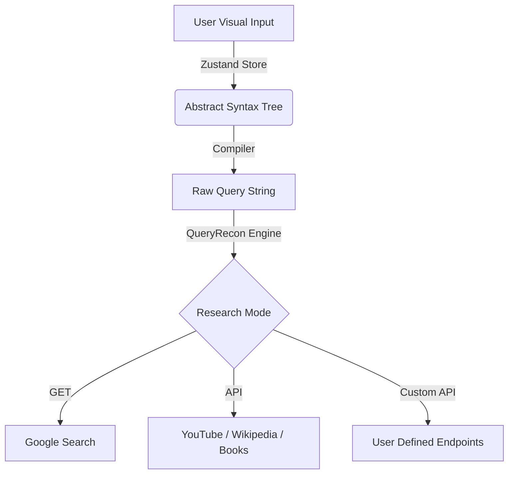
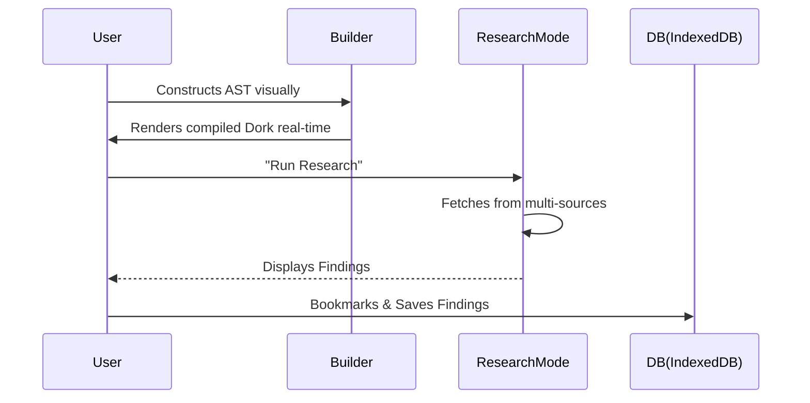
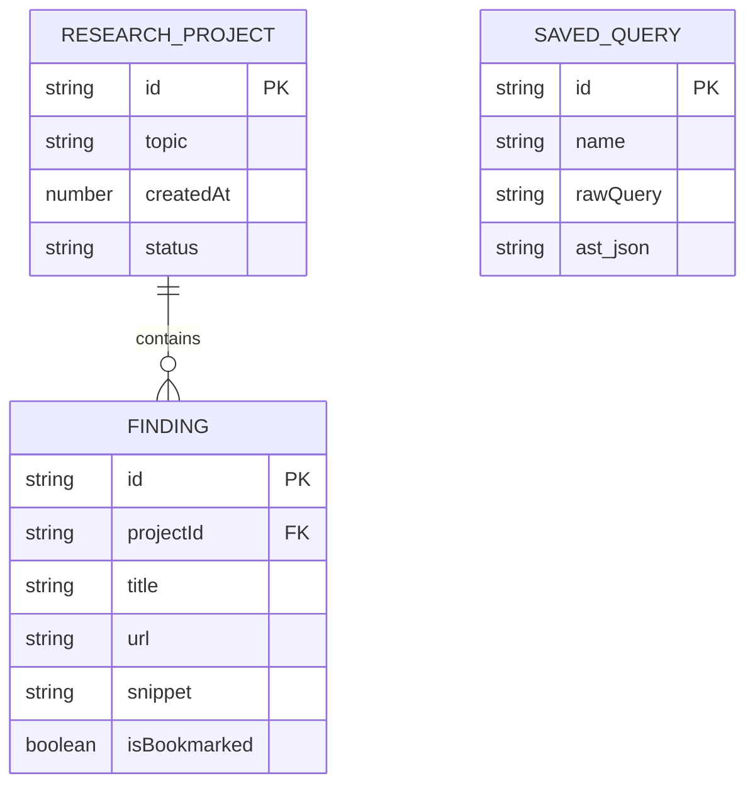

# 🌐 QueryRecon
> **The Ultimate Open-Source Intelligence (OSINT) & AST-Based Query Engine**

 

  <i>🛠️ Dev : Kashyap Gajjar</i>

---

## 🚀 What is QueryRecon?
QueryRecon is a next-generation visual query builder and multi-source intelligence gathering platform. It empowers security researchers, penetration testers, and OSINT analysts to visually construct complex boolean logic (AST), compile them into precise Google Dorks, and execute them across multiple intelligence streams seamlessly.

Gone are the days of manually typing complex nested queries. Build your logic visually, inject real-time API data, and save your findings—all in one place!

---

## ⚡ Mind-Blowing Features
* **🧠 Visual AST Query Builder:** Drag-and-drop boolean operators (AND, OR, NOT) to construct complex search hierarchies visually.
* **🔎 Dork Compiler:** Instantly compiles your visual graph into syntactically perfect Google Dorks (e.g., `ext:pdf (intitle:"admin" OR intext:"password")`).
* **🔌 Dynamic API Integrations:** Connects directly to YouTube, Wikipedia, Google Books, Academic Papers, and custom user-defined APIs.
* **📚 OSINT Templates Library:** Pre-loaded with high-quality OSINT dorks for file discovery, admin panel hunting, and credential leaks.
* **🕵️ Research Mode:** A multi-pane interface for launching your queries across various streams simultaneously. Includes bookmarking and report exporting.
* **💾 Local-First Architecture:** Built on IndexedDB. Your sessions, history, and saved queries never leave your browser unless you export them!

---

## 💡 Real-World Use Cases
1. **Threat Hunting:** Security teams can build complex AST graphs targeting specific malware indicators (e.g., exposed config files in S3 buckets) and save them as reusable templates.
2. **Academic Research:** Scholars can utilize the Google Books and Papers API endpoints combined with precise boolean filtering to instantly isolate relevant publications.
3. **Bug Bounty Recon:** Hunters can deploy the built-in "Admin Panels" or "Credential Leaks" dorks to rapidly uncover exposed administrative interfaces.

---

## 🏗️ How It Works (Internal Architecture)

### 1. Data Flow Diagram
This shows how user input in the visual builder is processed, compiled, and executed.

### 2. User Journey Workflow

### 3. Database Schema (IndexedDB)
QueryRecon runs completely offline using IndexedDB for speed and privacy.

---

  <i>Built with ❤️ by <b>Kashyap Gajjar</b> for the global cybersecurity community.</i>

